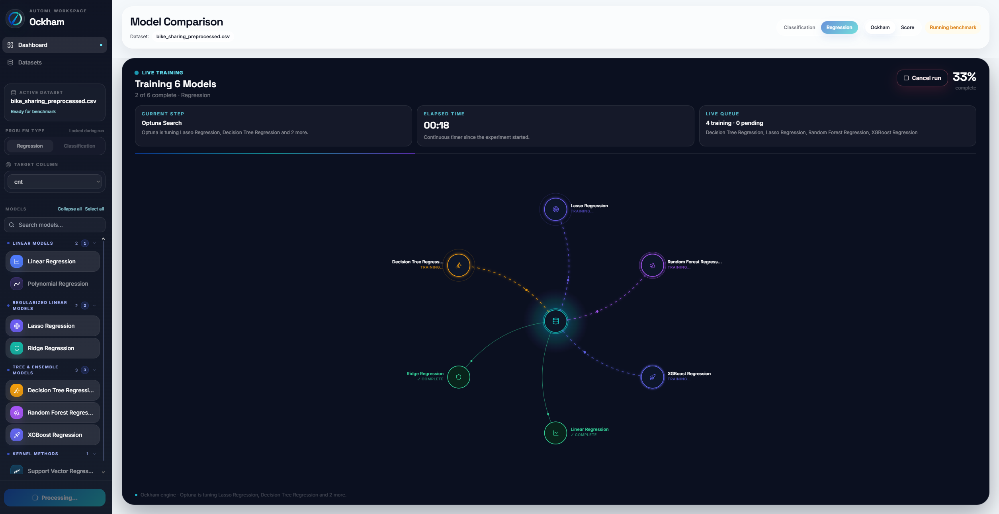
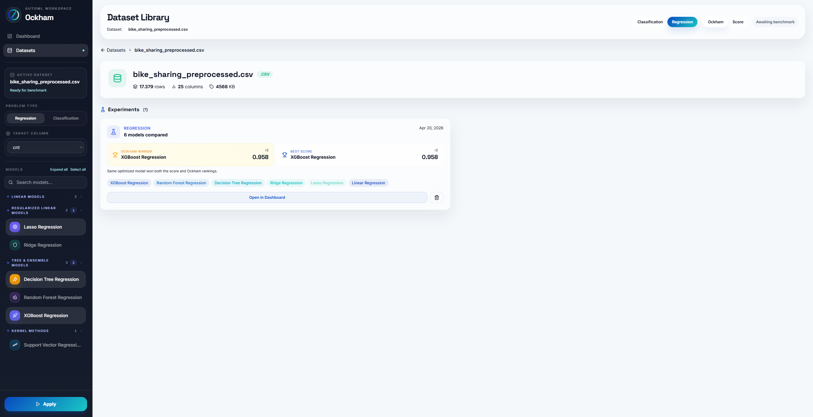
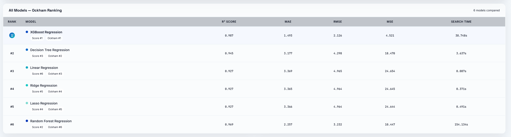
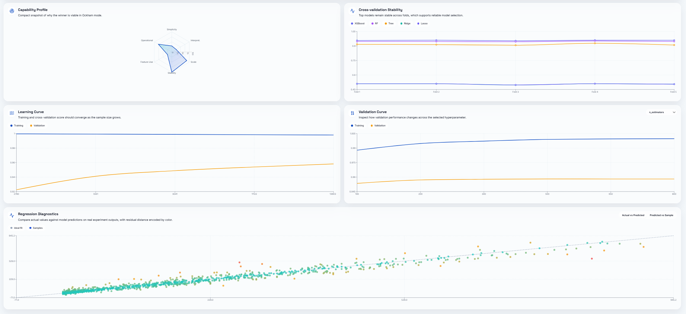

# Ockham

An interactive **React + FastAPI** application for structured **ML experimentation, model comparison, and evidence-based ranking** with an optional **LLM-assisted Ockham layer**.

## Table of Contents

- [Overview](#overview)
- [Why this project matters](#why-this-project-matters)
- [What makes Ockham different](#what-makes-ockham-different)
- [How it works](#how-it-works)
- [Core workflow and ranking model](#core-workflow-and-ranking-model)
- [Core features](#core-features)
- [Product screenshots](#product-screenshots)
- [Project structure](#project-structure)
- [Prerequisites](#prerequisites)
- [Local setup](#local-setup)
- [Docker setup](#docker-setup)
- [Testing](#testing)
- [Code quality](#code-quality)
- [Example workflow](#example-workflow)
- [Current limitations](#current-limitations)
- [Notes](#notes)

## Overview

Ockham turns tabular machine learning experimentation into a guided product workflow.

Instead of leaving model selection buried inside notebooks, ad hoc scripts, or metric-only leaderboards, Ockham provides a clearer operating path: upload a dataset, define the prediction problem, choose candidate models, run Optuna-backed training, inspect diagnostics, and compare both **score-based** and **evidence-based** rankings in a single interface.

This project is intentionally built as a compact, portfolio-ready example of applied ML engineering:

- **full-stack delivery** through a React frontend and a FastAPI backend
- **classical ML orchestration** for search, training, evaluation, and diagnostics
- **evidence-based model ranking** that goes beyond a single metric
- **optional LLM-assisted recommendation** to support the final tradeoff analysis
- **local-first reproducibility** with a shared `.env`, Docker support, SQLite persistence, and lightweight tests



## Why this project matters

Ockham is not positioned as a generic AutoML black box.

The core idea is simpler and more useful: help users compare candidate models in a way that is operationally interpretable. In many real projects, the highest score is not automatically the best choice. Training cost, stability, structural simplicity, feature efficiency, and scaling potential all matter.

This repository demonstrates skills that are valuable in Data Science, Applied AI, and ML Engineering work:

- designing an end-to-end experimentation product instead of a notebook-only workflow
- separating HTTP, orchestration, ML, LLM, persistence, and UI responsibilities into clear layers
- combining standard model evaluation with a more defensible recommendation workflow
- building for inspectability, local operability, and reproducibility
- structuring the repository so the product story is understandable from the codebase itself

## What makes Ockham different

Ockham evaluates candidate models through two complementary lenses:

- **Score ranking** answers: *which model performed best on the chosen metric?*
- **Ockham ranking** answers: *which model looks like the most defensible overall choice given the full evidence bundle?*

That second layer is what gives the project its identity.

Rather than treating experimentation as a flat metric table, Ockham assembles a richer comparison view that includes predictive performance, execution behavior, structural complexity, and feature usage. When enabled, the LLM layer receives a compact structured payload and recommends the most balanced tradeoff across candidates.

This makes Ockham better described as an **ML experimentation and model ranking workbench** than as a plain training runner.

## How it works

The application follows a practical experimentation pipeline:

1. **Dataset upload** stores a CSV dataset locally and registers its metadata in SQLite.
2. **Experiment setup** lets the user define the target column, problem type, and candidate models.
3. **Optuna-backed execution** trains and evaluates each candidate model in the backend.
4. **Score ranking** orders models by their primary metric and persists the experiment results.
5. **Ockham evidence assembly** normalizes predictive, structural, and execution signals across candidates.
6. **Optional LLM ranking** asks the configured Ollama model to recommend the most defensible tradeoff.
7. **Diagnostics and leaderboard views** expose comparison charts, fold stability, and model detail panels in the frontend.



## Core workflow and ranking model

The backend works with **tabular CSV datasets** and stores runtime state locally:

- uploaded datasets are persisted under `backend/storage/datasets/`
- experiment metadata and ranked results are stored in `backend/data/ockham.db`
- backend logs are stored under `backend/storage/logs/`

For each experiment, Ockham combines two ranking perspectives:

- **Score ranking** based on the primary model metric and standard CV outputs
- **Ockham ranking** based on a richer evidence bundle that includes:
  - predictive evidence
  - execution efficiency
  - feature usage efficiency
  - structural simplicity
  - interpretability and scalability considerations

When LLM ranking is enabled, the backend sends a compact structured evidence payload to Ollama and validates the returned structured decision before applying it.



## Core features

- CSV dataset upload and inspection
- Classification and regression experiment flows
- Model catalog grouped by problem type
- Optuna-backed search and training
- Score ranking and Ockham ranking
- Optional LangChain + Ollama integration for LLM-assisted model recommendation
- Experiment history, leaderboard views, and diagnostics panels
- Local, Docker, and test-friendly project structure

## Product screenshots

README images should live under `docs/assets/screenshots/` and stay focused on the product story, not on every screen in the app.

Recommended sequence already wired into this README:

1. `hero-dashboard.png` right after the overview
2. `experiment-setup.png` right after the workflow explanation
3. `score-vs-ockham-ranking.png` near the ranking model section
4. `diagnostics-panel.png` near the example workflow

Keep the set small and deliberate. Three or four strong screenshots are better than a long image gallery.

## Project structure

```text
ockham/
├─ README.md
├─ .env.example
├─ docker-compose.yml
├─ backend/
│  ├─ main.py
│  ├─ pyproject.toml
│  ├─ requirements.txt
│  ├─ requirements-dev.txt
│  ├─ Dockerfile
│  ├─ src/
│  │  ├─ ai/
│  │  ├─ api/
│  │  ├─ config/
│  │  ├─ db/
│  │  ├─ experiments/
│  │  │  ├─ application/
│  │  │  ├─ diagnostics/
│  │  │  ├─ persistence/
│  │  │  ├─ ranking/
│  │  │  └─ runtime/
│  │  ├─ modeling/
│  │  │  ├─ diagnostics/
│  │  │  ├─ registry/
│  │  │  └─ search/
│  │  ├─ preprocessing/
│  │  └─ utils/
│  └─ tests/
├─ frontend/
│  ├─ package.json
│  ├─ src/
│  │  ├─ app/
│  │  ├─ features/
│  │  │  ├─ datasets/
│  │  │  ├─ experiments/
│  │  │  │  └─ ranking/
│  │  │  ├─ preprocessing/
│  │  │  │  ├─ components/
│  │  │  │  └─ lib/
│  │  │  └─ workspace/
│  │  │     ├─ lib/
│  │  │     └─ state/
│  │  ├─ shared/
│  │  └─ styles/
├─ docs/
│  ├─ API.md
│  ├─ ARCHITECTURE.md
│  ├─ DOCKER.md
│  ├─ SETUP.md
│  └─ assets/
│     └─ screenshots/
├─ examples/
│  └─ sample_datasets/
└─ scripts/
```

## Prerequisites

To run the project locally, make sure you have:

- **Python 3.11**
- **Node.js 18+**
- **uv** (recommended) or pip
- **npm**
- **Docker + Docker Compose** for the containerized stack
- a local **Ollama** installation only if you want the LLM ranking path outside Docker

## Local setup

### 1) Create the environment file

```bash
cp .env.example .env
```

### 2) Review the main variables

At minimum, confirm these values:

- `OCKHAM_API_HOST`
- `OCKHAM_API_PORT`
- `OCKHAM_ENABLE_LLM_RANKING`
- `OCKHAM_OLLAMA_BASE_URL`
- `OCKHAM_OLLAMA_MODEL`
- `VITE_API_BASE_URL`
- `OCKHAM_FRONTEND_PROXY_TARGET`

### 3) Install backend dependencies

Using **uv**:

```bash
cd backend
uv sync
```

If you prefer pip:

```bash
cd backend
pip install -r requirements.txt
```

### 4) Run the backend

Using **uv**:

```bash
cd backend
uv run fastapi dev main.py
```

Alternative with pip:

```bash
cd backend
python -m fastapi dev main.py
```

### 5) Run the frontend

```bash
cd frontend
npm install
npm run dev
```

Default local endpoints:

- Frontend: `http://localhost:5173`
- Backend API: `http://127.0.0.1:8000`
- FastAPI docs: `http://127.0.0.1:8000/docs`

## Docker setup

To start the full stack (**Ollama + FastAPI + React/Nginx**):

```bash
docker compose up -d --build
```

After startup:

- Frontend: `http://localhost:8080`
- Backend API: `http://localhost:8000`
- FastAPI docs: `http://localhost:8000/docs`
- FastAPI docs through the frontend proxy: `http://localhost:8080/api/docs`

To reset the environment from scratch:

```bash
docker compose down -v
docker compose up -d --build
```

## Testing

Run the lightweight backend validation flow from the repository root:

```bash
python scripts/run_backend_checks.py
```

A backend smoke test is also available once the API is running:

```bash
python scripts/smoke_backend.py
```

The current automated checks are centered on:

- API header behavior
- response parsing for the LLM layer
- score ranking behavior
- backend compilation and Ruff checks

## Code quality

Run Ruff from `backend/`:

```bash
cd backend
ruff check .
```

Auto-fix lint issues when possible:

```bash
cd backend
ruff check . --fix
```

Format the backend codebase:

```bash
cd backend
ruff format .
```

Validate the frontend production build:

```bash
cd frontend
npm install
npm run build
```

## Example workflow

You can validate the product quickly with the demo files in `examples/sample_datasets/`:

- `bike_demand_regression_demo.csv`
- `customer_churn_classification_demo.csv`

A typical run looks like this:

1. upload one of the sample datasets
2. choose `regression` or `classification`
3. select the target column
4. choose a candidate model set
5. start the experiment
6. compare the score ranking and Ockham ranking in the dashboard
7. inspect diagnostics for the shortlisted models



## Current limitations

This repository is intentionally compact, so a few production-grade enhancements are still open:

- no CI pipeline is configured yet
- persistence is SQLite-based and aimed at local or controlled usage
- test coverage is still concentrated on selected backend flows
- Docker startup time depends on local machine resources and Ollama model download time
- there is no authentication or multi-user access model yet

## Notes

- Ockham currently accepts **CSV uploads only**.
- The API surface is intentionally small and grouped around `datasets`, `models`, and `experiments`.
- Runtime storage is split between SQLite in `backend/data/` and filesystem artifacts in `backend/storage/`.
- The repository now keeps only the documentation that still maps directly to the current codebase.
